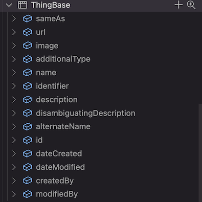

# Use `@themost/data` to create a data model

`@themost/data` is a module that provides a simple way to create a data model schema. A data model schema is a set of rules that define the structure of a data model. It defines the fields of the data model, the type of each field, and other properties of the data model.

This tutorial will show you how to create a simple data model schema.

## Create a data model

To create a data model, you need to create a new file in the `config/models` directory. The file name will be the name of the data model. For example, if you want to create a data model called `Product`, you need to create a file called `Product.json`.

```json
{
    "$schema": "https://themost-framework.github.io/themost/models/2018/2/schema.json",
    "name": "Product",
    "version": "2.1",
    "inherits": "Thing",
}
```

The `name` property is the name of the data model. The `version` property is the version of the data model. The `inherits` property is the name of the base data model. In this example, the `Product` data model inherits from the `Thing` data model. The `Thing` data model is a built-in data model that is used to represent any object in the system.

Important Note: Don't forget to use `$schema` property as `https://themost-framework.github.io/themost/models/2018/2/schema.json` in order to enable intellisense in your editor.

Let's see the json schema of `Thing` model

```json
{
    "$schema": "https://themost-framework.github.io/themost/models/2018/2/schema.json",
    "@id": "http://schema.org/Thing",
    "name": "Thing",
    "description": "The most generic type of item.",
    "title": "Thing",
    "abstract": false,
    "sealed": false,
    "hidden": true,
    "version": "2.0",
    "fields": [{
            "@id": "http://schema.org/sameAs",
            "name": "sameAs",
            "title": "sameAs",
            "description": "URL of a reference Web page that unambiguously indicates the item's identity. E.g. the URL of the item's Wikipedia page, Wikidata entry, or official website.",
            "type": "URL"
        },
        {
            "@id": "http://schema.org/url",
            "name": "url",
            "title": "url",
            "description": "URL of the item.",
            "type": "URL"
        },
        {
            "@id": "http://schema.org/image",
            "name": "image",
            "title": "image",
            "description": "An image of the item. This can be a <a class=\"localLink\" href=\"http://schema.org/URL\">URL</a> or a fully described <a class=\"localLink\" href=\"http://schema.org/ImageObject\">ImageObject</a>.",
            "type": "Text"
        },
        {
            "@id": "http://schema.org/additionalType",
            "name": "additionalType",
            "title": "additionalType",
            "description": "An additional type for the item, typically used for adding more specific types from external vocabularies in microdata syntax. This is a relationship between something and a class that the thing is in. In RDFa syntax, it is better to use the native RDFa syntax - the 'typeof' attribute - for multiple types. Schema.org tools may have only weaker understanding of extra types, in particular those defined externally.",
            "type": "Text",
            "value": "javascript:return this.model.name;",
            "readonly": true
        },
        {
            "@id": "http://schema.org/name",
            "name": "name",
            "title": "name",
            "description": "The name of the item.",
            "type": "Text"
        },
        {
            "@id": "http://schema.org/identifier",
            "name": "identifier",
            "title": "identifier",
            "description": "The identifier property represents any kind of identifier for any kind of <a class=\"localLink\" href=\"http://schema.org/Thing\">Thing</a>, such as ISBNs, GTIN codes, UUIDs etc. Schema.org provides dedicated properties for representing many of these, either as textual strings or as URL (URI) links. See <a href=\"/docs/datamodel.html#identifierBg\">background notes</a> for more details.",
            "type": "Text"
        },
        {
            "@id": "http://schema.org/description",
            "name": "description",
            "title": "description",
            "description": "A description of the item.",
            "type": "Text"
        },
        {
            "@id": "http://schema.org/disambiguatingDescription",
            "name": "disambiguatingDescription",
            "title": "disambiguatingDescription",
            "description": "A sub property of description. A short description of the item used to disambiguate from other, similar items. Information from other properties (in particular, name) may be necessary for the description to be useful for disambiguation.",
            "type": "Text"
        },
        {
            "@id": "http://schema.org/alternateName",
            "name": "alternateName",
            "title": "alternateName",
            "description": "An alias for the item.",
            "type": "Text"
        },
        {
            "@id": "https://themost.io/schemas/id",
            "name": "id",
            "title": "ID",
            "description": "The identifier of the item.",
            "type": "Counter",
            "primary": true
        },
        {
            "@id": "https://themost.io/schemas/dateCreated",
            "name": "dateCreated",
            "title": "dateCreated",
            "description": "The date on which this item was created.",
            "type": "DateTime",
            "readonly": true,
            "value": "javascript:return new Date();"
        },
        {
            "@id": "https://themost.io/schemas/dateModified",
            "name": "dateModified",
            "title": "dateModified",
            "description": "The date on which this item was most recently modified.",
            "type": "DateTime",
            "readonly": true,
            "value": "javascript:return (new Date());",
            "calculation": "javascript:return (new Date());"
        },
        {
            "@id": "https://themost.io/schemas/createdBy",
            "name": "createdBy",
            "title": "createdBy",
            "description": "Created by user.",
            "type": "User",
            "readonly": true,
            "value": "javascript:return this.user();"
        },
        {
            "@id": "https://themost.io/schemas/modifiedBy",
            "name": "modifiedBy",
            "title": "modifiedBy",
            "description": "Last modified by user.",
            "type": "User",
            "readonly": true,
            "value": "javascript:return this.user();",
            "calculation": "javascript:return this.user();"
        }
    ]
}
```

The `fields` property is an array of fields. Each field has a name, a type, and other properties. The `name` property is the name of the field. The `type` property is the type of the field. The `value` property is the default value of the field. The `readonly` property indicates whether the field is read-only. The `primary` property indicates whether the field is a primary key. The `calculation` property is a function that is used to calculate the value of the field.

Note: If you want to read more about the `Thing` data model, you can read the [schema.org](https://schema.org/Thing) documentation.

### Database schema

Each one of these fields are going to be represented as a column in the database table  e.g. `ThingBase` where the `id` field is the primary key of the table. The `dateCreated` field is the date on which the record was created. The `dateModified` field is the date on which the record was last modified. The `createdBy` field is the user who created the record. The `modifiedBy` field is the user who last modified the record.



 Each data model will have a corresponding table in the database which will be used to store the data of the data model. e.g. The `Product` data model will have a corresponding `ProductBase` table in the database. The `source` attribute of the data model is used to specify the name of the database table. If you don't specify the `source` attribute, the name of the database table will be the name of the data model with the suffix `Base`. 
 
 

 `ProductBase` table will have a foreign key to the `ThingBase` table. This foreign key will be used to represent the inheritance of the `Product` data model from the `Thing` data model.
 
 This table will be created automatically by the `@themost/data` module each time that you are upgrading your data model by increasing the `version` attribute. `@themost/data` data migration engine will automatically add new fields, remove unused fields or update existing ones.

`@themost/data`  will automatically create also a database view for each data model e.g. The `Product` data model will have a corresponding `ProductData` database view in the database. The `view` attribute of the data model is used to specify the name of the database view. If you don't specify the `view` attribute, the name of the database view will be the name of the data model with the suffix `Data`.

This database view will be used to query the data of the data model. It will be a join of a data model and its inherited model e.g.  the `ProductBase` table which represents `Product` with the `ThingBase` table which represents `Thing`.


### Define fields

Each data model has a set of fields. The type of each field can be a primitive type, such as `Text`, `Date`, `Number`, or a reference to another data model.

The following json schema represents `Product` model and defines all extra fields that represent this model which inherits `Thing`.

```json
{
    "$schema": "https://themost-framework.github.io/themost/models/2018/2/schema.json",
    "name": "Product",
    "version": "2.1",
    "inherits": "Thing",
    "fields": [
        {
            "name": "category",
            "title": "Category",
            "description": "A category related to this product.",
            "type": "Text"
        },
        {
            "name": "discontinued",
            "title": "Discontinued",
            "description": "Indicates whether this product is discontinued or not.",
            "type": "Boolean"
        },
        {
            "name": "price",
            "title": "Price",
            "description": "The price of the product.",
            "type": "Number"
        },
        {
            "name": "isRelatedTo",
            "title": "Is Related to",
            "description": "A pointer to another, somehow related product (or multiple products).",
            "type": "Product"
        },
        {
            "name": "isSimilarTo",
            "title": "Is Similar to",
            "description": "A pointer to another, functionally similar product (or multiple products).",
            "type": "Product"
        },
        {
            "name": "model",
            "title": "Model",
            "description": "The model of the product. Use with the URL of a ProductModel or a textual representation of the model identifier. The URL of the ProductModel can be from an external source. It is recommended to additionally provide strong product identifiers via the gtin8/gtin13/gtin14 and mpn properties.",
            "type": "Text"
        },
        {
            "name": "productID",
            "title": "Product ID",
            "description": "The product identifier, such as ISBN. For example: <code>&lt;meta itemprop='productID' content='isbn:123-456-789'/&gt;</code>.",
            "type": "Text"
        },
        {
            "name": "releaseDate",
            "title": "Release Date",
            "description": "The release date of a product or product model. This can be used to distinguish the exact variant of a product.",
            "type": "Date"
        }
    ]
}
```

Checkout [this example at stackblitz.com](https://stackblitz.com/edit/stackblitz-starters-a36ttb) to see how to define a simple model like `Product` using `@themost/data` module.


